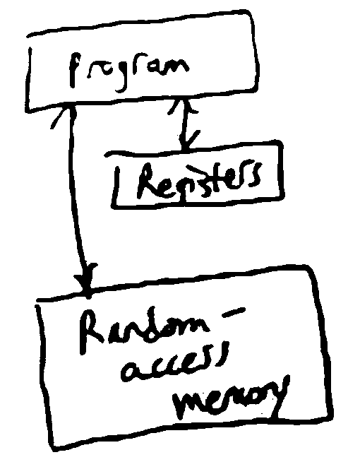

Algorithms
==========
*a computational procedure to solve a problem*

Problem
-------
*a mapping or relation from inputs to outputs*

- **Input**: an instance of the problem
    - e.g. an input might be a list of points in the convex hull problem
    - the encoding of the instance into a binary sequence is important - solving for lists of pairs of numbers is different than solving for strings
- **Output**: solution to the problem instance
    - e.g. a list of points making up the convex hull, in order
    - there can be multiple valid solutions for some problem instances, e.g. sorting

Key property of an algorithm for problem P: for any instance of P, running the algorithm on the instance
will cause it to eventually terminate and return a corresponding solution

If an algorithm does so, it is called *correct*.

To measure the time for an algorithm to execute, we need to define "computational procedure":

Computational Procedure
-----------------------
*the RAM model*

Idea: algorithm = program running on an abstract computer, e.g. Turing Machine (CSE 103)

The RAM model is an abstract computer that is more complex than TMs but closer to a real computer.

RAM Model
^^^^^^^^^

- registers
    - store some finite amount of finite-precision data (e.g. ints or floats)
- random access memory (RAM)
    - stores data like registers, but with infinitely many addresses
    - can look up the value at any address in constant time
- program
    - a sequence of instructions that dictate how to access RAM, put them into registers, operate on them, then write back to RAM
    - e.g. load value from RAM/store into RAM
    - arithmetic, e.g. ``add r3 r1 r2``
    - conditional branching, e.g. "if r1 has a positive value goto instruction 7"

So, an algorithm is a program running on a RAM machine - in practice, we define algoritms using pseudocode, and
each line of pseudocode might correspond to multiple RAM machine instructions.

Runtime
-------
The *runtime* of an algorithm (on a particular input) is then the number of executed instructions in the RAM machine.

To measure how efficient an algorithm is on all inputs, we use the *worst case* runtime for all inputs of a given size.

For a given problem, define some measure ``n`` of the size of an instance (e.g. how many points in the convex hull
input set, number of elements in a list, number of bits to encode input). Then the worst case runtime of an algorithm is
a function ``f(n) = the maximum runtime of the algorithm on inputs of size n``.

Ex. The convex hull gift wrapping algorithm has a worst-case runtime of roughly :math:`n^2`, where n is the # of
points.

.. note::
    Pseudocode may not be sufficient for runtime analysis (but fine for describing the algorithm) - for example, each
    of the lines below is not a constant time operation

    **Ex.** Sorting an array by brute force

    - Input: an array of integers ``[A[0]..A[n-1]]``

    .. code-block:: text

        For all possible permutations B of A:   # n!
            If B is in increasing order:        # O(n)
                Return B

    In total, this algorithm runs on the order of :math:`n! \cdot n` time (worst case).

"Efficient"
^^^^^^^^^^^
For us, "efficient" means *polynomial time* - i.e. the worst case runtime of the algorithm is bounded above by
some polynomial in the size of the input instance.

E.g. the convex hull algorithm was bounded by :math:`cn^2` for some :math:`c`, but the brute force sorting algorithm
can take :math:`> n!` steps, so it is not polynomial time.

.. note::
    e.g. "bounded above": :math:`f(n) = 2n^2+3n+\log n \leq 6n^2`

    i.e. there exists a polynomial that is greater than the function for any n.

    e.g. :math:`2^n` is not bounded above by any polynomial

In practice, if there is a polynomial time algorithm for a problem, there is usually one with a small exponent and
coefficients (but there are exceptions).

Polynomial-time algorithms are *closed under composition*, i.e. if you call a poly-time algorithm as a subroutine
polynomially many times, the resulting algorithm is still poly-time.

Asymptotic Notation
-------------------
*a notation to express how quickly a function grows for large n*

Big-O
^^^^^
*upper bound*

:math:`f(n) = O(g(n))` iff :math:`\exists n_0` s.t. for all :math:`n \geq n_0, f(n) \leq cg(n)`
where :math:`c` is some constant

*f* is asymptotically bounded above by some multiple of *g*.

Ex. 

- :math:`5n = O(n)`
- :math:`5n + \log n = O(n)`
- :math:`n^5 + 3n^2 \neq O(n^4)` since for any constant c, :math:`n^5` is eventually larger than :math:`cn^4`
- :math:`n^5 + 3n^2 = O(n^5) = O(n^6)`

.. note::
    :math:`O(g)` gives an upper bound, but not necessarily the tightest such bound.

Big-:math:`\Omega`
^^^^^^^^^^^^^^^^^^
*lower bound*

:math:`f(n) = \Omega(g(n))` if :math:`\exists c > 0, n_0` s.t. :math:`\forall n \geq n_0, f(n) \geq cg(n)`

Ex.

- :math:`5n = \Omega(n)`
- :math:`5n+2 = \Omega(n)`
- :math:`n^2 = \Omega(n)`

Big-:math:`\Theta`
^^^^^^^^^^^^^^^^^^
*tight bound*

:math:`f(n) = \Theta(g(n))` if :math:`f(n) = O(g(n))` and :math:`f(n) = \Omega(g(n))`

- if :math:`f(n) = \Theta(n)`, it is *linear time*
- :math:`\log n = O(n)` but :math:`\neq \Theta(n)`
- :math:`5n^2+3n = \Theta(n^2)`