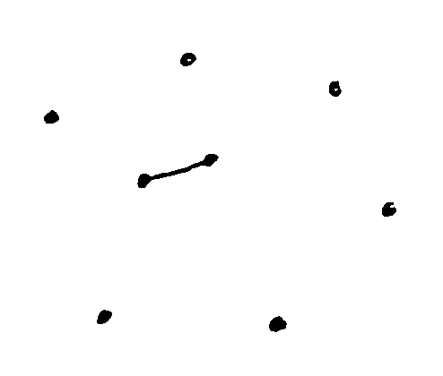
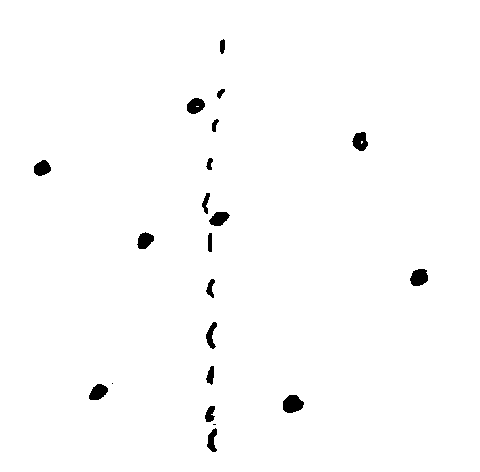
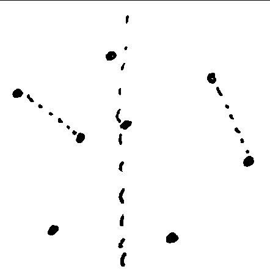
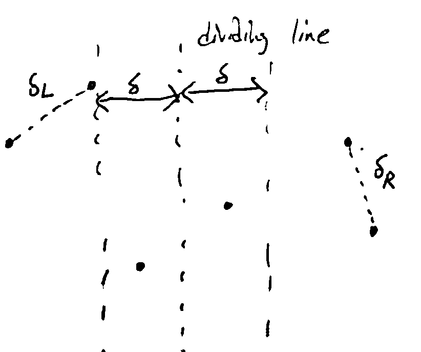
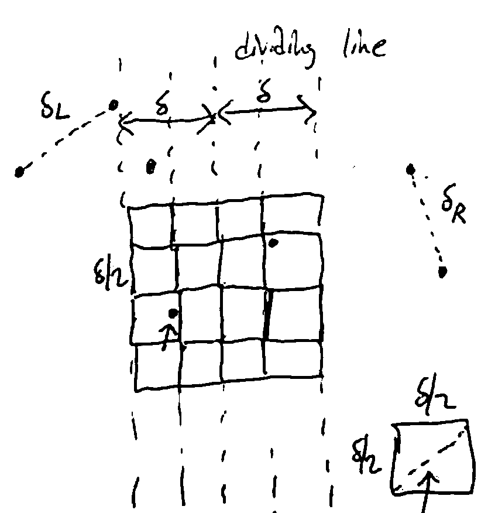

Divide-and-Conquer Algorithms
=============================
*general paradigm used by many algorithms*

1. *Divide* the problem into subproblems
2. *Conquer* (solve) each subproblem with a recursive call
3. *Combine* the subproblem solution into an overall solution

This approach is helpful when it isn't clear how to solve a large problem directly, but you can rewrite it in terms
of smaller problems. Coming up with a way to divide/conquer may be easier than solving the whole problem.

Mergesort
---------
e.g. Mergesort: sort a list by recursively sorting two halves - the hard part is merging two sorted lists.

.. code-block:: text

    define merge(B, C):

    B = [3, 5, 5, 7]  # example data
    C = [1, 4, 6]
    D = []

    look at the first element of each list
    pop the smaller and append it to D (or use a pointer to track where in each list you are, etc)

    B = [3, 5, 5, 7]
    C = [4, 6]
    D = [1]

    repeat until at least one list is empty

    B = [5, 5, 7]
    C = [4, 6]
    D = [1, 3]

    B = [5, 5, 7]
    C = [6]
    D = [1, 3, 4]

    B = [5, 7]
    C = [6]
    D = [1, 3, 4, 5]

    B = [7]
    C = [6]
    D = [1, 3, 4, 5, 5]

    B = [7]
    C = []
    D = [1, 3, 4, 5, 5, 6]

    append the rest of the non-empty list to D

The runtime of the merge operation is linear, i.e. :math:`\Theta(|B|+|C|)`

Now we can define mergesort:

.. code-block:: py

    def mergesort(A[0..n-1]):
        if n <= 1:
            return A
        mid = floor(n/2)
        left = mergesort(A[0..mid-1])
        right = mergesort(A[mid..n-1])
        return merge(left, right)

The runtime is covered in section (a/n: I didn't attend, but it's :math:`\Theta(n \log n)`).

Proving Mergesort
^^^^^^^^^^^^^^^^^
How do we prove its correctness? For D/C, induction - assume the recursive calls are correct, and prove correctness
given that.

Need to prove that for any list ``A[0..n-1]``, ``mergesort(A)`` is a sorted permutation of A. Prove by (strong)
induction on n.

- Base Case: :math:`n \leq 1`
    - Then ``mergesort(A) = A``
    - but A is already sorted.
- Inductive Case: Take any :math:`n > 1`, and assume the inductive hypothesis holds for all :math:`k < n`.
    - Then :math:`m = \lfloor n/2 \rfloor < n`
    - the length of the left half is :math:`m`
    - the length of the right half is :math:`(n-1)-m+1=n-m=n-\lfloor n/2 \rfloor=\lceil n/2 \rceil < n`
    - so ``B = mergesort(A[0..m-1])`` is a sorted permutation of ``A`` (by IH)
    - similarly, ``C = mergesort(A[m..n-1])`` is a sorted permutation of ``A``
    - since B and C are sorted, by correctness of ``merge()``, D is a sorted permutation of B concatenated with C
    - since B is a permutation of the ``A[0..m-1]`` and C is a permutation of ``A[m..n-1]``, D is a permutation of ``A[0..n-1]``

Designing
---------
Two questions:

- How do you divide the problem into subproblems?
- How do you combine the subproblem solutions to get an overall solution?

Integer Multiplication
----------------------
Given integers x, y, compute ``x * y``.

.. note::
    On a RAM machine, you can only multiply numbers in constant time if they fit in registers; otherwise you
    need an algorithm.

Elementary Multiplication
^^^^^^^^^^^^^^^^^^^^^^^^^

.. code-block:: text

        37
    x  114
    ------
       148
       370
    + 3700
    ------
      4218

If *x* and *y* have *n* digits each, how long does this algorithm take? Each iteration takes linear time, and there are
linearly-many iterations, so :math:`\Theta(n^2)` in total.

Divide-and-Conquer
^^^^^^^^^^^^^^^^^^
Simple idea: split the digits in half, e.g. :math:`4216 = 42 * 10^2 + 16`

In general, given an :math:`\leq n`-digit integer *x*, :math:`x = x_1*10^{n/2}+x_0` (assuming *n* is a power of 2).

Likewise, we can write :math:`y = y_1*10^{n/2}+y_0`.

Then:

.. math::

    xy & = (x_1*10^{n/2}+x_0) * (y_1*10^{n/2}+y_0) \\
    & = x_1y_1*10^n + (x_1y_0+x_0y_1)*10^{n/2} + x_0y_0

This results in 4 multiplications of :math:`n/2`-digit numbers: do these recursively. The multiplications by
:math:`10^n` are just adding zeros, and the additions can be done in linear time.

So, as there are 4 recursive calls, we have:

.. math::

    T(n) = 4T(n/2) + \Theta(n)

By the master theorem, this results in :math:`T(n) = \Theta(n^2)` - which is not faster than the naive algorithm.

Gotta Go Fast
^^^^^^^^^^^^^
Let's look at

.. math::

    z & = (x_1+x_0)(y_1+y_0) \\
    & = x_1y_1 + (x_1y_0 + x_0y_1) + x_0y_0

Then :math:`x_1y_0 + x_0y_1 = z - x_1y_1 - x_0y_0`.

So with only 3 multiplications, we can get all 3 terms we need for the algorithm:

- :math:`x_1y_1`
- :math:`x_0y_0`
- :math:`(x_1+x_0)(y_1+y_0) = z`

and you can substitute into the earlier equation :math:`xy = x_1y_1*10^n + (z - x_1y_1 - x_0y_0)*10^{n/2} + x_0y_0`
to obtain the product.

.. math::

    & \text{KoratsubaMult}(x, y): \\
    & \text{If x and y fit in registers (e.g. } x, y < 2^{32} \text{), return } x*y. \\
    & \text{Split x into } x_1, x_0 \text{ s.t. } x = x_1*10^{n/2}+x_0 \text{ and } y = y = y_1*10^{n/2}+y_0 \\
    & z \leftarrow \text{KoratsubaMult}(x_1+x_0, y_1+y_0) \\
    & x_1y_1 \leftarrow \text{KoratsubaMult}(x_1, y_1) \\
    & x_0y_0 \leftarrow \text{KoratsubaMult}(x_0, y_0) \\
    & \text{return } x_1y_1*10^n + (z - x_1y_1 - x_0y_0)*10^{n/2} + x_0y_0

This results in a speedup at every recursive call, which adds up.

Now our recurrence is :math:`T(n) = 3T(n/2) + \Theta(n)`, which by the master theorem results in
:math:`T(n) = \Theta(n^{\log_2 3}) \approx \Theta(n^{1.58})`

This is faster than the naive algorithm!

Gotta Go Faster
^^^^^^^^^^^^^^^
There is, in fact, a faster algorithm that runs in :math:`O(n \log n \log \log n)` based on the Fast Fourier Transform -
but it only really starts being faster when you reach *n* in the thousands.

This algorithm is not covered in this class - see AD 5.6 or CLRS 30.

.. image:: https://what-if.xkcd.com/imgs/a/13/laser_pointer_more_power.png

Well.

In 2019, a :math:`O(n \log n)` algorithm was found, but the point at which it becomes faster is only for astronomically
large *n*.

Closest Pair
------------
*find the closest pair of points in the plane*

Given a set of *n* points in the plane, find the pair of points which are closest together.

Naive algorithm: Check all possible pairs, and take the pair with least distance (:math:`\Theta(n^2)`).

D/C Algorithm
^^^^^^^^^^^^^
Divide: take the left and right halves of the points

- In order to do this efficiently, start by sorting the points by their x-coordinate
- Then the first half of the sorted array has the leftmost n/2 points, and the second half the n/2 rightmost

Then, use recursive calls to find the closest pair of points on the left side and right side.

But, we haven't considered pairs where one point is in the left half and the other is in the right half.

If we simply checked all pairs such that one point was on the left and one was on the right, we'd still end up with
:math:`\Theta(n^2)`. Instead, we filter out many pairs which cannot be the closest.

**Idea**: If the recursive calls find pairs at distances :math:`\delta_L, \delta_R` from each other on the left
and right sides respectively, then we can ignore all points that are further than
:math:`\delta = \min(\delta_L, \delta_R)` from the dividing line.

Now, we can consider only the points in the "tube". We can find the points inside this tube in linear time, since
the points are sorted by x-coord already.

**Idea 2**: On both the left and right, no pairs are closer than :math:`\delta` together. By drawing boxes of
size :math:`\delta/2 \times \delta/2`, there is *at most one* point in each box.

Then, any point on the left can only be within :math:`\delta` of a finite number of boxes on the right.

So, we'll take the points in the left and right halves of the tube, and consider them in y-coordinate order
(sort by y at beginning of algorithm so this is linear). For each point, compute its distance to the next
15 points in the order, keeping track of the closest pair found so far.

.. note::
    Why 15? Because we drew these boxes, if a point is to be within :math:`\delta` of the considered point, it
    must be within one of the next 15 boxes. We check 15 points for the worst case scenario, if every single
    box is full.

    .. image:: _static/divide6.png
        :width: 250

If we find a pair that is closer than :math:`\delta`, return that pair; otherwise return the pair at distance
:math:`\delta`.

Runtime
^^^^^^^

- First, we sort by *x* and *y* at the beginning: :math:`2n\log n = \Theta(n \log n)`
    - This doesn't affect the recurrence, since it only happens once, not at each level of recursion.
- Recursive part: 2 calls for the left and right: :math:`2T(n/2)`
- Then a linear amount of work to filter out points not in the tube: :math:`\Theta(n)`
- Then linear amount of work again, comparing each point to the 15 next points: :math:`15n = \Theta(n)`

So we have :math:`T(n)=2T(n/2)+\Theta(n)`, which is :math:`T(n)=\Theta(n \log n)`.