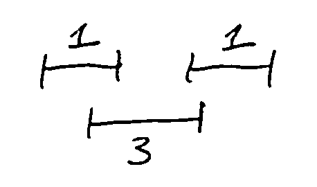
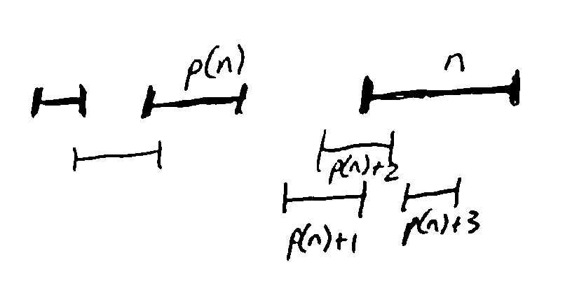
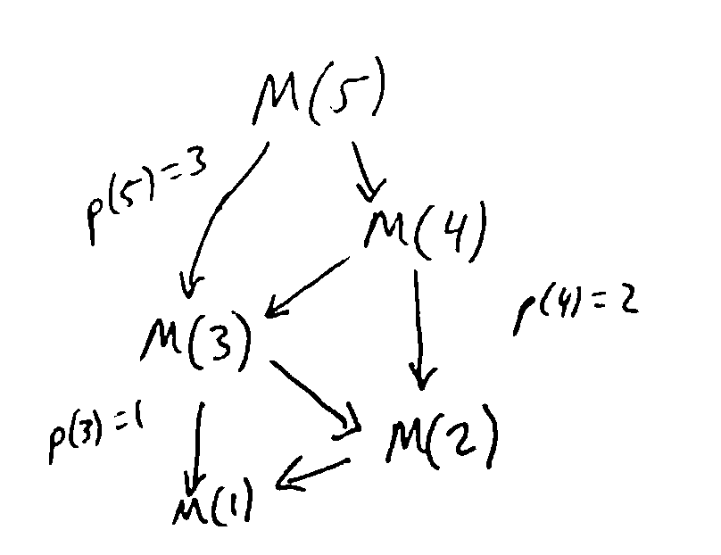

Dynamic Programming
===================
Fundamental idea: write the optimal solution to a problem in terms of optimal solutions to smaller subproblems.

When this is possible, the problem is said to have *optimal substructure*)

When you can do this, you get a recursive algorithm as in divide/conquer. The difference is that usually the
subproblems overlap.

Weighted Interval Solving Problem
---------------------------------
Like ISP from earlier, we have *n* requests for a resource with starting and finishing times, but now each request
has a *value* :math:`v_i`. We want to maximize the total value of granted requests.

**Goal**: Find a subset *S* of requests which is compatible and maximixes :math:`\sum_{i \in S} v_i`.

Let's sort the requests by finishing time, so request 1 finishes first, etc.

To use dynamic programming, we need to write an optimal solution in terms of optimal solutions of subproblems. Note
that an optimal solution *O* either includes the last request *n* or doesn't.

If :math:`n \in O`, then *O* doesn't contain any intervals overlapping with *n*; let :math:`p(n)` be the last interval
in the order that *doesn't* overlap with *n*.

Then intervals :math:`p(n)+1, p(n)+2, ..., n-1` are excluded from *O*, but *O* must contain an optimal solution for
intervals :math:`1, 2, ..., p(n)`.

.. note::
    If there were a better solution for intervals :math:`1, 2, ..., p(n)`, then we could improve *O* without introducing
    any conflicts with *n* (exchange argument).

If instead :math:`n\notin O`, then *O* must be an optimal solution for intervals :math:`1, 2, ..., n-1`.

.. note::
    If *O* was not an optimal solution for intervals :math:`1, 2, ..., n-1`, we could improve *O* as above.

So, either *O* is an optimal solution for intervals :math:`1, ..., p(n)` plus *n*, or it is an optimal solution for
intervals :math:`1, ..., n-1`.

If we then let :math:`M(i)` be the maximal total value for intervals ``[1, i]``, we have:

.. math::

    M(i) & = \max(M(p(i)) + v_i, M(i-1)) \text{ for } i > 1 \\
    M(1) & = v_1

This recursive equation gives us a recursive algorithm to compute the largest possible total value overall, which is
:math:`M(n)`. We can then read off which intervals to use for an optimal set:

- if :math:`M(n) = M(p(n)) + v_n`, then include interval *n*
- if :math:`M(n) = M(n-1)`, then exclude interval *n*

then continue recursively from :math:`p(n)` or :math:`n-1` respectively.

**Runtime**

Recursion tree has 2 subproblems, but depth :math:`\approx n`. So in total, the runtime is :math:`\approx 2^n`.

But there are only *n* *distinct* subproblems: :math:`M(1), M(2), ..., M(n)`. Our exponentially many calls are just
doing the same work over and over again.

Solution: *memoization* - whenever we solve a subproblem, save its solution in a table; when we need it later, just
look it up instead of doing further recursion.

Here, we use a table :math:`M[1..n]`. Each value is then computed at most once, and work to compute a value is constant,
so total runtime will be linear (assuming :math:`p(i)` is computed).

Another way to think about memoization: it turns a recursion tree into a DAG by collapsing identical nodes together.

.. note::
    Instead of memoization on a recursive algorithm, we can also eliminate recursion and just compute the "memo table"
    iteratively in a suitable order.

    In the example above, could just compute M[1], M[2], ..., M[n] in increasing order: then all subproblems needed
    to compute M[i] will already have been computed (since M[i] only depends on M[j] with j<i)

    .. code-block::

        M[1] = v1
        for i from 2 to n:
            M[i] = max(M[p(i)] + vi, M[i - 1])

TLDR: Dynamic programming = recursive decomposition into subproblems + memoization

Design
------
Main steps for designing a dynamic programming algorithm:

1. Define a notion of subproblem; there should only be polynomially-many distinct subproblems
2. Derive a recursive equation expressing the optimal solution of a subproblem in terms of optimal solutions to "smaller" subproblems
3. Express the solution to the original problem in terms of one or more subproblems
4. Work out how to process subproblems "in order" to get an iterative algorithm

Edit Distance
-------------
*Levenshtein Distance*

Distance metric between strings, e.g. "kitten" and "site".

:math:`d(s, t)` = minimum number of character insertions, deletions, or substitutions (replacing a single character
with another) needed to turn *s* into *t*.

**Ex**:

.. code-block:: text

    kitten
    sitten
    siten
    site

This is the shortest sequence of transformations, so :math:`d(kitten, site) = 3`. Very useful for approximate string
matching, e.g. spell checking, OCR, DNA sequence alignment (see textbook)

Naive algorithm (checking all strings reachable with 1 op, 2 ops, etc) could take exponential time - let's improve with
dynamic programming.

**Problem**: Given strings ``s[1..n]`` and ``t[1..m]``, compute :math:`d(s, t)`. To divide into subproblems, let's look
at *prefixes* of *s* and *t*.

Let :math:`D(i, j)` be the edit distance between ``s[1..i]`` and ``t[1..j]``. We ultimately want to compute
:math:`D(n, m)`.

Let's find a recursive equation for :math:`D(i, j)`. Suppose we had an optimal sequence of operations transforming
``s[1..i]`` into ``t[1..j]``. Without loss of generality, we can assume the operations proceed from left to right;
then can view the sequence as an "edit transcript" saying for each character of *s* what operation(s) to perform,
if any.

**Ex**: (S = sub, I = insert, D = delete, M = noop)

.. code-block:: text

    kitten -(sub k)> sitten -(del t)> siten -(del n)> site

    transcript: SMMDMD

Look at the last operation in the transcript. Several possibilities:

- If I, the sequence is an optimal seq. turning ``s[1..i]`` into ``t[1..j-1]`` followed by the insertion of ``t[j]``, so :math:`D(i, j) = D(i, j-1)+1`.
- If D, the seq. is an optimal one turning ``s[1..i-1]`` into ``t[1..j]``, followed by deleting ``s[i]``, so :math:`D(i, j) = D(i-1, j) + 1`.
- If S, the seq. is an optimal one turning ``s[1..i-1]`` into ``t[1..j-1]``, followed by turning ``s[i]`` into ``t[j]``, so :math:`D(i, j) = D(i-1, j-1) + 1`.

