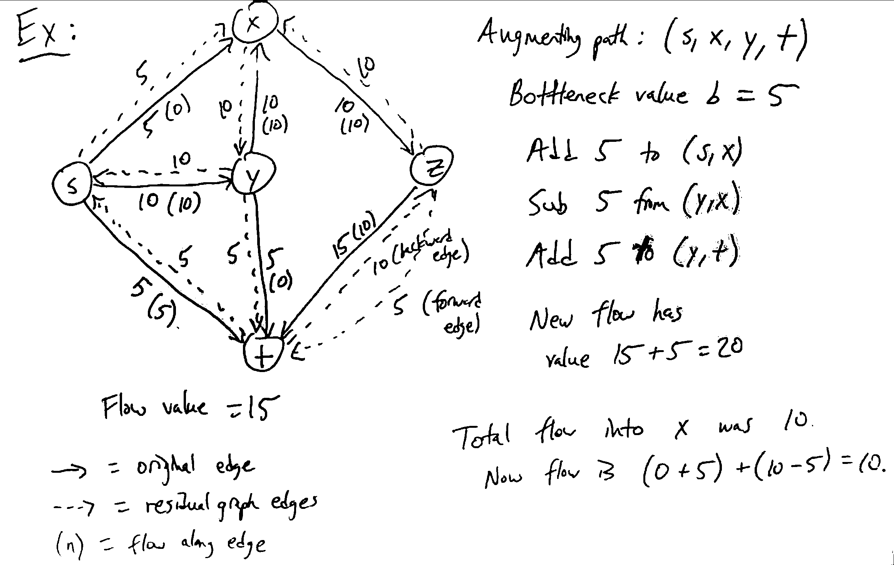
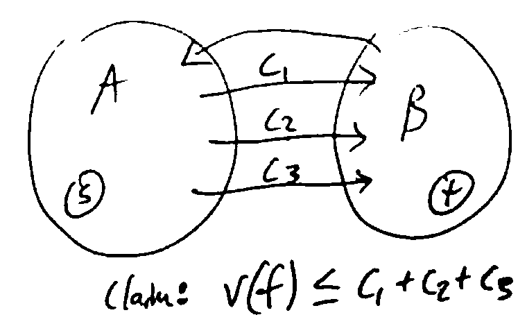
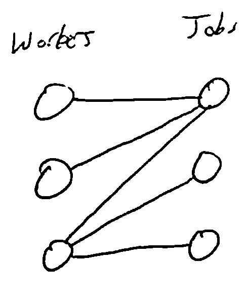
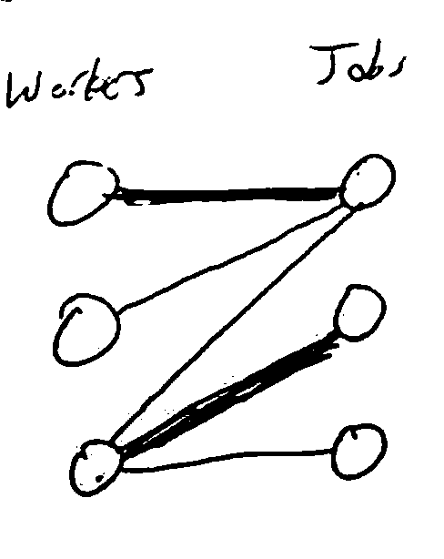
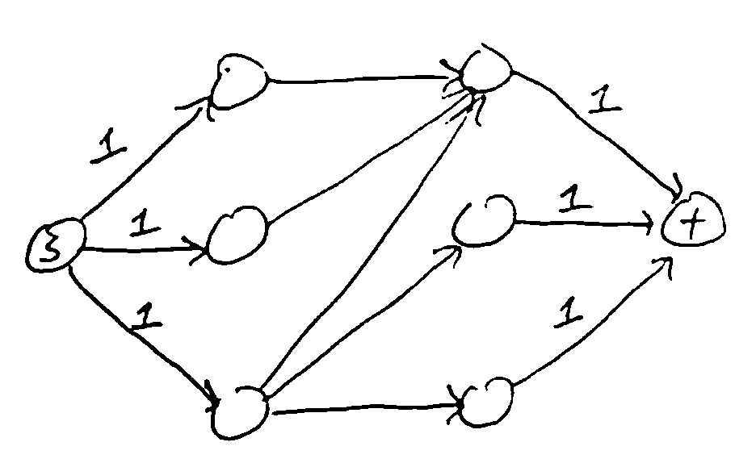

Network Flow
============

Idea: model a network as a graph where some material (water, data, etc) flows along edges, but each edge has a maximum
*capacity* for flow.

.. image:: _static/flow1.png
    :width: 250

Like MST and shortest paths, many problems from many areas (e.g. transportation, communication, image processing) can
be put in this form.

Flow Networks
-------------
A flow network is a directed graph :math:`G=(V,E)` where each edge *e* has a nonnegative capacity :math:`c_e` (for
simplicity, assume capacities are integers).

There are also designated *source* and *sink* nodes :math:`s, t \in V`.

All other nodes are called *internal* nodes.

We assume every node has at least 1 edge connected to it (otherwise we remove it).

S-T Flow
--------
An *s-t flow* (or simply "flow") is a function :math:`f: E \to \mathbb{R}` (where :math:`f(e)` is the amount of flow
along edge *e*) satisfying:

1. For all :math:`e \in E, 0 \leq f(e) \leq c_e` (flow does not exceed capacity
2. For all internal nodes *v*, :math:`\sum_{(u, v)\in E} f(e)= \sum_{(v, u)\in E} f(e)` (flow into *v* = flow out
   of *v*; conservation of mass)

.. image:: _static/flow2.png
    :width: 500

Flow into *u*: :math:`f(s, u) = 20`

Flow out of *u*: :math:`f(u, v) + f(u, t) = 10 + 10 = 20`

The *value* of a flow *f* is the total flow coming out of the source: :math:`v(f) = \sum_{(s, u) \in E} f(e)`.

In the example above, :math:`v(f) = f(s, u) + f(s, v) = 20 + 0 + 20`.

Maximum-Flow Problem
--------------------
Given a flow network, find a flow with the largest possible value.

To solve this, there's a natural greedy approach: given a flow, incrementally try to increase the flow along some path
from *s* to *t*.

1. Start with 0 flow at each edge: this is a valid flow.
2. Given a path from *s* to *t*, look at the *minimum* capacity of edges along it: this is the bottleneck for adding
   flow along the path. Add this much flow along each edge.

**Ex**: Consider the path :math:`(s, u, v, t)`. Minimum capacity is 20, so we could "push" 20 units of flow along the
path to get a flow of higher value.

.. image:: _static/flow3.png
    :width: 250

We could then try to push more flow along a different path, etc. However, in this example, we get stuck! There are no
more paths we can push flow on, but this flow is not optimal.

In order to get an optimal flow (of value 30 in this example), we would need to *decrease* the flow from *u* to *v*
from 20 to only 10. To keep track of which edges can be increased or decreased, we use the *residual graph*.

The residual graph :math:`G_f` of a flow *f* has the same vertices as *G*, and for every edge :math:`e = (u, v)` of *G*:

1. If :math:`f(e) < c_e`, there is :math:`c_e - f(e)` *residual capacity* (unused capacity), so we add a *forward edge*
   :math:`(u, v)` to :math:`G_f` with capacity :math:`c_e - f(e)`.
2. If :math:`f(e) > 0`, we could decrease the flow by up to :math:`f(e)`, so we add a *backward edge* :math:`(v, u)` to
   :math:`G_f` with capacity :math:`f(e)`.

**Ex**: In the flow above, :math:`G_f` is:

.. image:: _static/flow4.png
    :width: 250

.. note::
    For each edge of *G*, there can be 1 or 2 edges in :math:`G_f`.

We'll call a path from *s* to *t* in :math:`G_f` which doesn't repeat vertices an *augmenting path*. Given such a path,
we can *augment* the flow *f* as follows: if *b* is the weight of the least-weight edge along the path, then we consider
each edge of the path in turn:

- if it is a forward edge, increase the flow along it in *G* by *b*
- if it is a backward edge, decrease the flow along the reverse edge in *G* by *b*.

.. image:: _static/flow5.png
    :width: 700

**Lemma**: The result of augmenting a flow along any augmenting path is a valid flow of higher value.

This then enables a greedy approach to max flow:

Ford-Fulkerson Method
---------------------

- start with the all-zero flow *f*
- while there is a path from *s* to *t* in :math:`G_f`:
    - take any augmenting path *p*
    - augment *f* along *p*
- return *f*

Termination and Runtime
^^^^^^^^^^^^^^^^^^^^^^^
Invariant: Flow along each edge is an integer.

- True initially, since we start with the all-zero flow
- If true at one iteration, the residual capacities are all integers since the flows and capacities are integers. So
  the bottleneck *b* is an integer, and the new flow will all be integers.

So the value of the flow increases every iteration (see lemma) and is an integer, and since it can't exceed
:math:`\sum_{e=(s,v)\in E}c_e`, the value of the flow has to eventually stop growing so the loop must eventually
terminate.

If the value of the maximum flow is *F*, there are in fact at most *F* iterations, since :math:`b \geq 1`. So if the
network has *n* vertices and *m* edges, we can implement FF in :math:`O(mF)` time:

1. Building the residual graph takes :math:`O(n+m)` time, which is :math:`O(m)` since each vertex has at least one edge
2. Finding an augmenting path with BFS/DFS takes :math:`O(m)` time
3. Augmenting the flow requires iterating over the path and takes :math:`O(m)`

Optimality
^^^^^^^^^^
Idea: Flow from *s* to *t* cannot exceed the total capacity of edges crossing a cut which separates *s* from *t*.

A partition of *V* into two sets :math:`(A, B)` with :math:`s\in A, t\in B` is an *s-t cut*.

The *capacity* of the cut is the total capacity of all edges from *A* to *B*:

.. math::

    c(A,B) & =\sum_{e=(u, v)\in E, u \in A, v \in B}c_e \\
           & = \sum_{e \text{ out of } A}c_e

Given a flow *f*, let :math:`f^{out}(A) = \sum_{e \text{ out of } A} f(e)` and
:math:`f^{in}(A) = \sum_{e \text{ into } A} f(e)`

Lemma
"""""
:math:`v(f)=f^{out}(A)-f^{in}(A)`

**Proof**: By definition, :math:`v(f)=f^{out}(s)`. Also :math:`f^{in}(s)=0` since *s* has no incoming edges. So
:math:`v(f)=f^{out}(s)-f^{in}(s)`. Also, by conservation of flow, for any :math:`v \in A` *besides* *s*,
:math:`f^{out}(v)=f^{in}(v)`. So :math:`v(f)=\sum_{v\in A}(f^{out}(v)-f^{in}(v))`. Now consider the contribution of
every edge :math:`e=(u, v)` to this sum:

- If an edge from *A* to *A*, its flow :math:`f(e)` appears as a positive term in :math:`f^{out}(u)` and a negative
  term in :math:`f^{in}(v)`, which cancel out.
- If an edge from *A* to *B*, it contributes :math:`f(e)` to the sum
- If an edge from *B* to *A*, it contributes :math:`-f(e)`
- If an edge from *B* to *B*, it contributes 0

So the sum is equivalent to

.. math::

    & \sum_{e \text{ out of } A} f(e) - \sum_{e \text{ into } A} f(e) \\
    & = f^{out}(A)-f^{in}(A).

**Corollary**: For any flow *f* and s-t cut :math:`(A, B), v(f)\leq c(A, B)`.

Theorem
"""""""
When FF algorithm returns *f*, there is an s-t cut :math:`(A, B)` such that :math:`v(f)=c(A,B)`.

**Proof**: When FF terminates, there is no path from *s* to *t* in :math:`G_f`. So if *A* is all vertices reachable from
*s* in :math:`G_f`, and *B* is all other vertices, :math:`(A, B)` is an s-t cut.

There are no edges from *A* to *B* in :math:`G_f`, since otherwise the destination in *B* would be reachable from *s*.

So for any edge *e* from *A* to *B* in the original graph *G*, we must have :math:`f(e)=c_e`, since otherwise there
would be a forward edge from *A* to *B* in :math:`G_f`.

Likewise, for any edge *e* from *B* to *A* in *G*, we must have :math:`f(e)=0`, since otherwise there would be a
backward edge from *A* to *B* in :math:`G_f`.

Now by earlier lemma:

.. math::

    v(f)  & = f^{out}(A) - f^{in}(A) \\
    & = \sum_{e \text{ out of } A} f(e) - \sum_{e \text{ into } A} f(e) \\
    & = \sum_{e \text{ out of } A} c_e \\
    & = c(A, B).

**Corollary**: Since no flow has value greater than the capacity of a cut, the flow returned by FF is optimal.

**Corollary**: The cut :math:`(A, B)` from the theorem above is a minimum cut: its capacity is as small as possible.
(If there were one with a smaller capacity, the flow would have to have a smaller value)

This means we can use FF to find a minimum s-t cut in a graph: run it to find the flow *f*, then build :math:`(A, B)`
as in the theorem.

**Theorem (Max-Flow Min-Cut)**: In any flow network, the maximum value of an s-t flow is the minimum value of an s-t
cut.

.. note::
    Since FF always finds a flow with integer flows on all edges, there is always a maximum flow of this form.

Runtime Revisited
^^^^^^^^^^^^^^^^^
Our runtime bound of :math:`O(mF)` with *F* being the value of the max-flow isn't good when the capacities in the
network are large (*F* could be large). But it turns out that if you use BFS to find the *shortest* augmenting path,
the algorithm takes at most :math:`O(nm^2)` time.

This choice of path is called the Edmonds-Karp algorithm.

Applications
------------

- Routing problems (get data from point A to B, maximizing throughput)
- Matching problems, e.g. bipartite matching

Bipartite Matching
^^^^^^^^^^^^^^^^^^
Suppose we have *n* workers with different skills, and various jobs to do which some subsets of the workers are
qualified to do. We want to assign workers to jobs so that as many jobs get done as possible, with no worker
assigned multiple jobs and no job assigned multiple workers.

Model this problem using a *bipartite graph*: vertices for workers and jobs, with edges indicating who can do which
jobs.

Then we want to find a *maximum matching*: a set of edges *M* where no two edges share a vertex and is as large as
possible.

**Idea**: construct a network for instance such that the maximum flow is obtained by matching as many workers to jobs
as possible.

Think of each worker as having 1 unit of work, which can be allocated to any of the jobs they can perform.

- Add source node *s* and capacity 1 edges to each worker
- Add capacity 1 edges from each worker to each possible job they can do
- Add capacity 1 edges from each job to a sink node *t*

To show this works, need to prove 2 directions:

- If there is a matching with *k* edges, there is a flow of value *k*: flow 1 unit to each of the *k* workers assigned
  a job, then along the matched edges to their corresponding jobs, then to *t*.
- Conversely, given a maximum flow with value *k* from FF, we can assume all flows on all edges are integers. Then
  there must be *k* jobs with 1 unit of flow coming out, and the rest have 0.
    - For those *k* jobs, they must have 1 unit of flow coming from a unique worker.
    - We can assign that worker to this job and get a valid assignment.

So every maximum matching corresponds to a maximum flow, and vice versa, and we can use FF to find such max a flow,
and reconstruct the matching.

Since the maximum flow value is at most *n* (all workers assigned to jobs), the runtime of FF will be :math:`O(nm)`.
