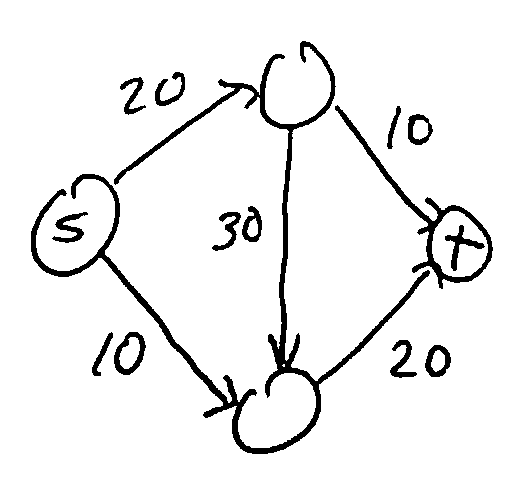
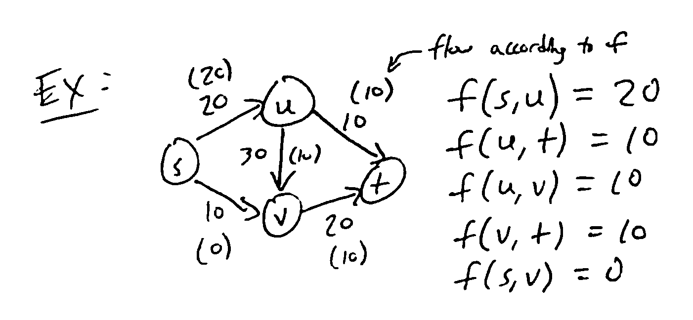
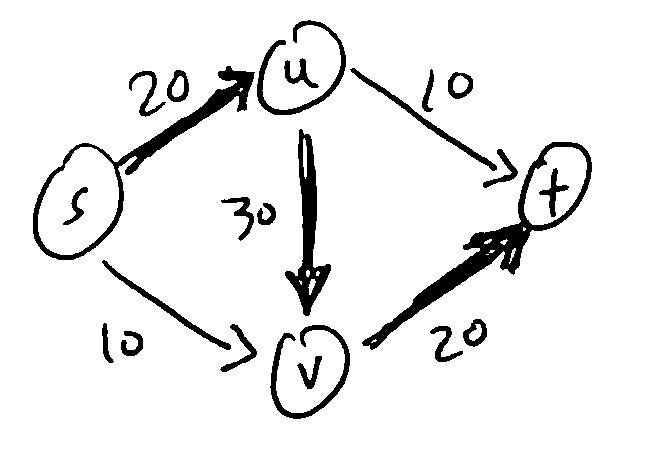
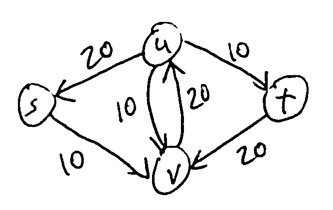
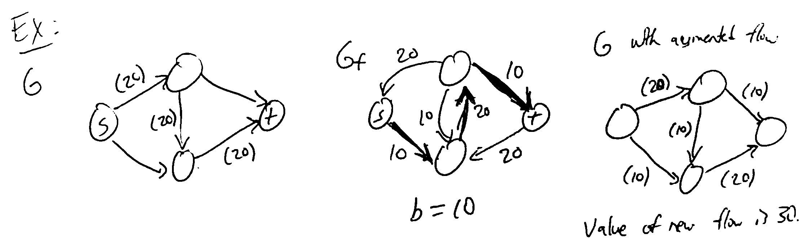

Network Flow
============

Idea: model a network as a graph where some material (water, data, etc) flows along edges, but each edge has a maximum
*capacity* for flow.

Like MST and shortest paths, many problems from many areas (e.g. transportation, communication, image processing) can
be put in this form.

Flow Networks
-------------
A flow network is a directed graph :math:`G=(V,E)` where each edge *e* has a nonnegative capacity :math:`c_e` (for
simplicity, assume capacities are integers).

There are also designated *source* and *sink* nodes :math:`s, t \in V`.

All other nodes are called *internal* nodes.

We assume every node has at least 1 edge connected to it (otherwise we remove it).

S-T Flow
--------
An *s-t flow* (or simply "flow") is a function :math:`f: E \to \mathbb{R}` (where :math:`f(e)` is the amount of flow
along edge *e*) satisfying:

1. For all :math:`e \in E, 0 \leq f(e) \leq c_e` (flow does not exceed capacity
2. For all internal nodes *v*, :math:`\sum_{(u, v)\in E} f(e)= \sum_{(v, u)\in E} f(e)` (flow into *v* = flow out
   of *v*; conservation of mass)

Flow into *u*: :math:`f(s, u) = 20`

Flow out of *u*: :math:`f(u, v) + f(u, t) = 10 + 10 = 20`

The *value* of a flow *f* is the total flow coming out of the source: :math:`v(f) = \sum_{(s, u) \in E} f(e)`.

In the example above, :math:`v(f) = f(s, u) + f(s, v) = 20 + 0 + 20`.

Maximum-Flow Problem
--------------------
Given a flow network, find a flow with the largest possible value.

To solve this, there's a natural greedy approach: given a flow, incrementally try to increase the flow along some path
from *s* to *t*.

1. Start with 0 flow at each edge: this is a valid flow.
2. Given a path from *s* to *t*, look at the *minimum* capacity of edges along it: this is the bottleneck for adding
   flow along the path. Add this much flow along each edge.

**Ex**: Consider the path :math:`(s, u, v, t)`. Minimum capacity is 20, so we could "push" 20 units of flow along the
path to get a flow of higher value.

We could then try to push more flow along a different path, etc. However, in this example, we get stuck! There are no
more paths we can push flow on, but this flow is not optimal.

In order to get an optimal flow (of value 30 in this example), we would need to *decrease* the flow from *u* to *v*
from 20 to only 10. To keep track of which edges can be increased or decreased, we use the *residual graph*.

The residual graph :math:`G_f` of a flow *f* has the same vertices as *G*, and for every edge :math:`e = (u, v)` of *G*:

1. If :math:`f(e) < c_e`, there is :math:`c_e - f(e)` *residual capacity* (unused capacity), so we add a *forward edge*
   :math:`(u, v)` to :math:`G_f` with capacity :math:`c_e - f(e)`.
2. If :math:`f(e) > 0`, we could decrease the flow by up to :math:`f(e)`, so we add a *backward edge* :math:`(v, u)` to
   :math:`G_f` with capacity :math:`f(e)`.

**Ex**: In the flow above, :math:`G_f` is:

.. note::
    For each edge of *G*, there can be 1 or 2 edges in :math:`G_f`.

We'll call a path from *s* to *t* in :math:`G_f` which doesn't repeat vertices an *augmenting path*. Given such a path,
we can *augment* the flow *f* as follows: if *b* is the weight of the least-weight edge along the path, then we consider
each edge of the path in turn:

- if it is a forward edge, increase the flow along it in *G* by *b*
- if it is a backward edge, decrease the flow along the reverse edge in *G* by *b*.

**Lemma**: The result of augmenting a flow along any augmenting path is a valid flow of higher value.

This then enables a greedy approach to max flow:

Ford-Fulkerson Method
^^^^^^^^^^^^^^^^^^^^^

- start with the all-zero flow *f*
- while there is a path from *s* to *t* in :math:`G_f`:
    - take any augmenting path *p*
    - augment *f* along *p*
- return *f*