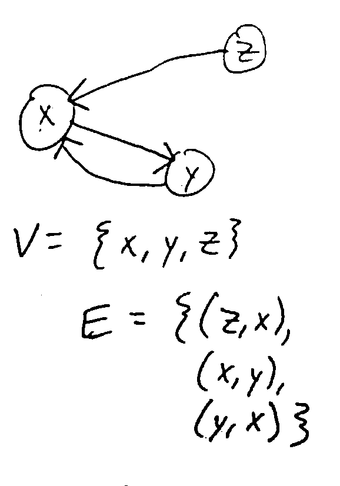
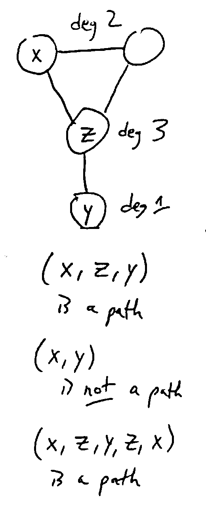
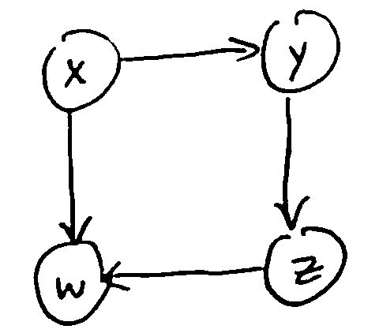
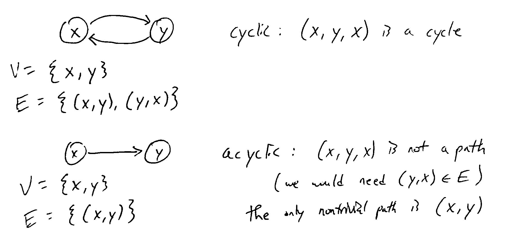
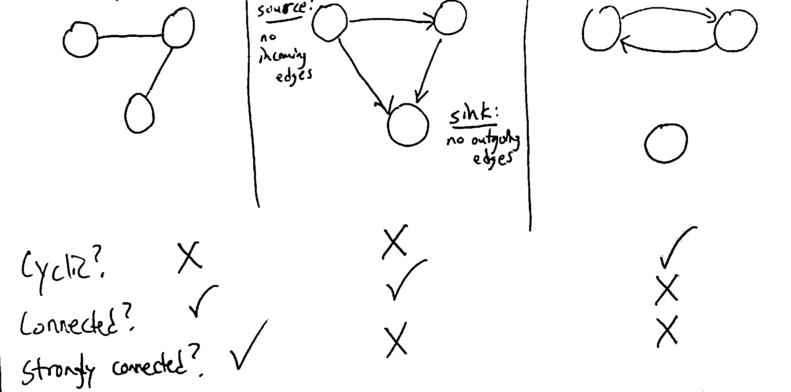
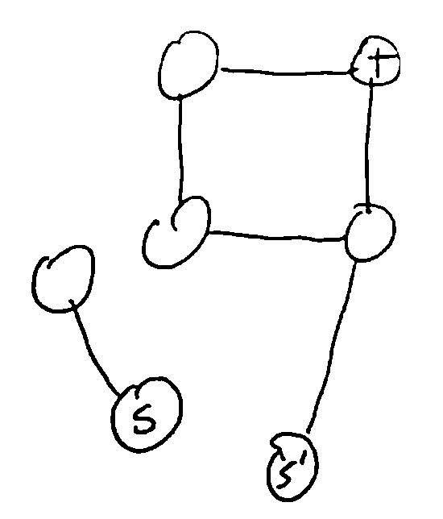
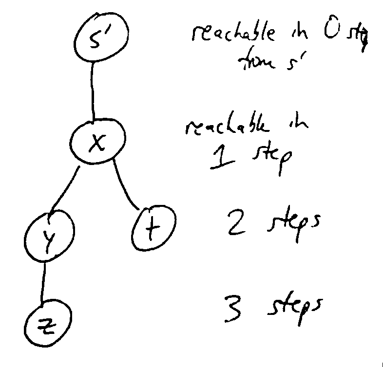
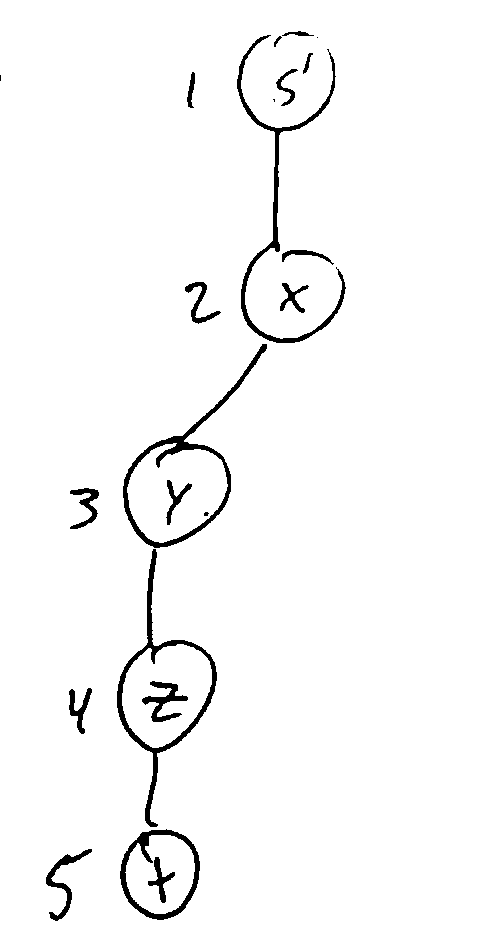
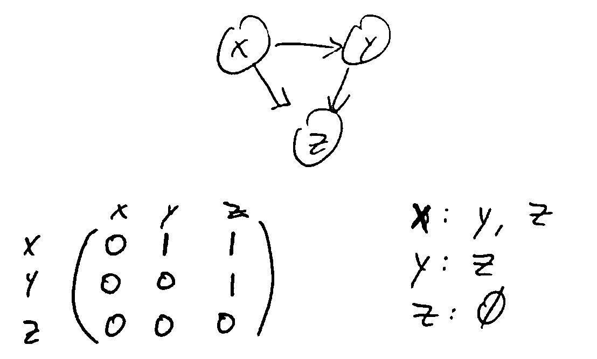

Graphs
======
A graph is a pair :math:`(V, E)` where :math:`V` is the set of vertices (nodes) and :math:`E \subseteq V \times V` is
the set of edges (i.e. pairs :math:`(u, v)` where :math:`u, v \in V`).

.. note::
    The image above is a directed graph (digraph), where the direction of the nodes matter. In an undirected graph,
    the direction doesn't matter, so :math:`\forall u,v \in V, (u, v) \in E \iff (v, u) \in E`.

For a vertex :math:`v \in V`, its *outdegree* is the number of edges going out from it, and its *indegree* is
the number of edges going into it.

In an undirected graph, this is simplified to *degree*: the number of edges connected to an edge.

A *path* in a graph :math:`G = (V, E)` is a sequence of vertices :math:`v_1, v_2,... ,v_k \in V` where
for all :math:`i < k, (v_i, v_{i+1}) \in E` (i.e. there is an edge from each vertex in the path to the next).

A path is *simple* if it contains no repeated vertices.

A *cycle* is a nontrivial path starting and ending at the same vertex. A graph is *cyclic* if
it contains a cycle, or *acyclic* if not.

.. note::
    For a digraph, nontrivial means a path of at least 2 nodes. For an undirected graph, it's at least 3
    (cannot use the same edge to go back and forth)

**Ex.** This digraph is acyclic: :math:`(x, y, z, w, x)` is not a path, since there is no path from *w* to *x*.

Some more examples:

A graph is *connected* if :math:`\forall u, v \in V`, there is a path from *u* to *v* or vice versa.

A digraph is *strongly connected* if :math:`\forall u, v \in V`, there is a path from *u* to *v*. (For undirected
graphs, connected = strongly connected.)

.. note::
    For a directed graph mith more than one vertex, being strongly connected implies that the graph is cyclic,
    since a path from *u* to *v* and vice versa exists.

Algorithms
----------

S-T Connectivity Problem
^^^^^^^^^^^^^^^^^^^^^^^^
Given vertices :math:`s, t \in V`, is there a path from *s* to *t*? (Later: what's the shortest such path?)

BFS
^^^

.. image:: https://imgs.xkcd.com/comics/depth_and_breadth_2x.png
    :width: 350

Traverse graph starting from a given vertex, processing vertices in the order they can be reached. Only visit each
vertex once, keeping track of the set of already visited vertices. Often implemented using a FIFO queue.

The traversal can be visualized as a tree, where we visit nodes in top-down, left-right order.

.. code-block:: c

    BFS(v):
        Initialize a FIFO queue with a single item v
        Initialize a set of seen vertices with a single item v
        while the queue is not empty:
            u = pop the next element in the queue
            Visit vertex u
            for each edge (u, w):
                if w is not already seen:
                    add it to the queue
                    add it to set of seen vertices

.. note::
    When we first add a vertex to the queue, we mark it as seen, so it can't be added to the queue again. Since there
    are only finitely-many vertices, BFS will eventually terminate.

    Each edge gets checked at most once (in each direction), so if there are *n* vertices and *m* edges, the runtime
    is :math:`\Theta(n+m)` (assuming you can get the edges out from a vertices in constant time).

DFS
^^^
Traverse like BFS, except recursively visit all descendants of a vertex before moving on to the next one (at the same
depth). This can be implemented without a queue, only using the call stack.

.. code-block:: c

    DFS(v):
        mark v as visited
        for each edge (v, u):
            if u is not visited, DFS(u)

.. note::
    As with DFS, we visit each vertex at most once, and process each edge at most once in each direction, so runtime
    is :math:`\Theta(n+m)`.

    We call :math:`\Theta(n+m)` linear time for graphs with *n* vertices and *m* edges.

Representing Graphs
^^^^^^^^^^^^^^^^^^^

- Adjacency lists: for each vertex, have a list of outgoing edges
    - Allows for linear iteration over all edges from a vertex
- Adjancency matrix: a matrix with entry :math:`(i, j)` indicating an edge from *i* to *j*
    - Constant time to check if a particular edge exists
    - but the size based on number of vertices is :math:`\Theta(n^2)`

