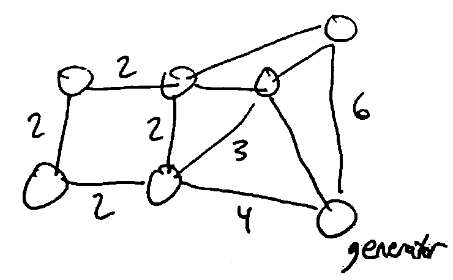

Graphs
======
A graph is a pair :math:`(V, E)` where :math:`V` is the set of vertices (nodes) and :math:`E \subseteq V \times V` is
the set of edges (i.e. pairs :math:`(u, v)` where :math:`u, v \in V`).

.. note::
    The image above is a directed graph (digraph), where the direction of the nodes matter. In an undirected graph,
    the direction doesn't matter, so :math:`\forall u,v \in V, (u, v) \in E \iff (v, u) \in E`.

For a vertex :math:`v \in V`, its *outdegree* is the number of edges going out from it, and its *indegree* is
the number of edges going into it.

In an undirected graph, this is simplified to *degree*: the number of edges connected to an edge.

A *path* in a graph :math:`G = (V, E)` is a sequence of vertices :math:`v_1, v_2,... ,v_k \in V` where
for all :math:`i < k, (v_i, v_{i+1}) \in E` (i.e. there is an edge from each vertex in the path to the next).

.. image:: _static/graphs2.png
    :width: 250

A path is *simple* if it contains no repeated vertices.

A *cycle* is a nontrivial path starting and ending at the same vertex. A graph is *cyclic* if
it contains a cycle, or *acyclic* if not.

.. note::
    For a digraph, nontrivial means a path of at least 2 nodes. For an undirected graph, it's at least 3
    (cannot use the same edge to go back and forth)

**Ex.** This digraph is acyclic: :math:`(x, y, z, w, x)` is not a path, since there is no path from *w* to *x*.

.. image:: _static/graphs3.png
    :width: 250

Some more examples:

.. image:: _static/graphs4.png
    :width: 750

A graph is *connected* if :math:`\forall u, v \in V`, there is a path from *u* to *v* or vice versa.

A digraph is *strongly connected* if :math:`\forall u, v \in V`, there is a path from *u* to *v*. (For undirected
graphs, connected = strongly connected.)

.. note::
    For a directed graph mith more than one vertex, being strongly connected implies that the graph is cyclic,
    since a path from *u* to *v* and vice versa exists.

Algorithms
----------

S-T Connectivity Problem
^^^^^^^^^^^^^^^^^^^^^^^^
Given vertices :math:`s, t \in V`, is there a path from *s* to *t*? (Later: what's the shortest such path?)

.. image:: _static/graphs6.png
    :width: 250

BFS
^^^

.. image:: https://imgs.xkcd.com/comics/depth_and_breadth_2x.png
    :width: 350

Traverse graph starting from a given vertex, processing vertices in the order they can be reached. Only visit each
vertex once, keeping track of the set of already visited vertices. Often implemented using a FIFO queue.

The traversal can be visualized as a tree, where we visit nodes in top-down, left-right order.

.. image:: _static/graphs7.png
    :width: 250

.. code-block:: c

    BFS(v):
        Initialize a FIFO queue with a single item v
        Initialize a set of seen vertices with a single item v
        while the queue is not empty:
            u = pop the next element in the queue
            Visit vertex u
            for each edge (u, w):
                if w is not already seen:
                    add it to the queue
                    add it to set of seen vertices

.. note::
    When we first add a vertex to the queue, we mark it as seen, so it can't be added to the queue again. Since there
    are only finitely-many vertices, BFS will eventually terminate.

    Each edge gets checked at most once (in each direction), so if there are *n* vertices and *m* edges, the runtime
    is :math:`\Theta(n+m)` (assuming you can get the edges out from a vertices in constant time).

DFS
^^^
Traverse like BFS, except recursively visit all descendants of a vertex before moving on to the next one (at the same
depth). This can be implemented without a queue, only using the call stack.

.. code-block:: c

    DFS(v):
        mark v as visited
        for each edge (v, u):
            if u is not visited, DFS(u)

.. note::
    As with DFS, we visit each vertex at most once, and process each edge at most once in each direction, so runtime
    is :math:`\Theta(n+m)`.

    We call :math:`\Theta(n+m)` linear time for graphs with *n* vertices and *m* edges.

Representing Graphs
-------------------

- Adjacency lists: for each vertex, have a list of outgoing edges
    - Allows for linear iteration over all edges from a vertex
    - Checking if a particular edge exists is expensive
    - Size for *n* vertices, *m* edges = :math:`\Theta(n + m)`
- Adjancency matrix: a matrix with entry :math:`(i, j)` indicating an edge from *i* to *j*
    - Constant time to check if a particular edge exists
    - but the size based on number of vertices is :math:`\Theta(n^2)`

.. image:: _static/graphs9.png
    :width: 350

A graph with *n* vertices has :math:`\leq {n \choose 2}` edges if undirected, or :math:`\leq n^2` if directed and
we allow self-loops (or :math:`\leq n(n-1)` if no self loops).

In all cases, :math:`m=O(n^2)`. This makes the size of an adjacency list :math:`O(n^2)`.

If we really have a ton of edges, the two representations are the same; but if you have a *sparse* graph
(:math:`m << n^2`), then the adjacency list is more memory-efficient.

This means that a :math:`\Theta(n^2)` algorithm can run in linear time (:math:`\Theta(n+m)`) on *dense* graphs
because :math:`m = \Theta(n^2)`.

So :math:`\Theta(n^2)` is optimal for dense graphs, but not for sparse graphs.

More Problems
-------------

Cyclic Test
^^^^^^^^^^^
*testing if a graph is cyclic*

- use DFS to traverse, keep track of vertices visited along the way
- if we find an edge back to any such vertex, we have a cycle

Topological Order
^^^^^^^^^^^^^^^^^
- Finding a topological ordering of a DAG (directed acyclic graph)
    - an ordering :math:`v_1, v_2, v_n` of the vertices such that if :math:`(v_i, v_j) \in E`, then :math:`i < j`
    - we can find topological order using *postorder traversal* in DFS
        - after DFS has visited all descendants of a vertex, prepend the vertex to the topological order
    - make sure to iterate all connected components of the graph, not just one

.. code-block:: c

    def Topo-Sort(G):
        for v in V:
            if v is not visited:
                Visit(v)

    def Visit(v):
        mark v as visited
        mark v as in progress // temporarily
        for edges (v, u) in E:
            if u is in progress, G is cyclic // there is no topological order
            if u is not visited:
                Visit(u)
        mark v as not in progress
        prepend v to the topological order

Minimum Spanning Tree
---------------------
Suppose you need to wire all houses in a town together (represented as a graph, and the edges represent where power
lines can be built), Build a power line to use the minimal amount of wire.

Given a weighted graph, (i.e. each edge has a numerical weight), we want to find a minimum spanning tree:
a selection of edges of G that connects every vertex, is a tree (any cycles are unnecessary), and has least total
weight.

Kruskal's Algorithm
^^^^^^^^^^^^^^^^^^^
Main idea: add edges to the tree 1 at a time, in order from least weight to largest weight, skipping edges that
would create a cycle

This is an example of a greedy algorithm, since it picks the best available option at each step.

We use a disjoint-set forest to keep track of sets of connected components.

Initially, all vertices are in their own sets. When we add an edge, we Union the sets of its two vertices together.
If we would add an edge that would connect two vertices in the same set, we skip it (it would cause a cycle).

.. code-block:: c
    :linenos:

    def Kruskal(G, weights w):
        initialize a disjoint-set forest on V
        sort E in order of increasing w(e)
        while all vertices are not connected:  // i.e. until n-1 edges are added
            take the next edge from E, (u, v)
            if Find(u) != Find(v):
                add (u, v) to the tree
                Union(u, v)

Runtime:

- L2: :math:`\Theta(n)`
- L3: :math:`\Theta(m \log m)`
- L4: :math:`m` iterations of the loop worst case
    - Note that this lets us use the amortized runtime of Find and Union
    - L6: two finds (:math:`\Theta(\alpha(n))` each)
    - L8: and a union (:math:`\Theta(\alpha(n))`)
- Note that :math:`m \alpha(n) < m \log m` since :math:`n \leq m`

So the total runtime is :math:`\Theta(m \log m) = \Theta(m \log n)` (since :math:`m = \Omega(n)` since G is connected).

This assumes G is represented by an adjacency list, so that we can construct the list E in :math:`\Theta(m)` time.

Prim's Algorithm
^^^^^^^^^^^^^^^^
Main idea: build the tree one vertex at a time, always picking the cheapest vertex

.. image:: _static/graphs15.png
    :width: 200

Need to maintain a set of vertices S which have already been connected to the root; also need to maintain the cost of
all vertices which could be added next (the "frontier"). 

Use a priority queue to store these costs: the key of vertex :math:`v \notin S` will be
:math:`\min w((u, v) \in E), u \in S`

After selecting a vertex *v* of least cost and adding it to *S*, some vertices may now be reachable via
cheaper edges, so we need to decrease their keys in the queue.

.. code-block:: c
    :linenos:

    def Prim(G, weights w, root r):
        initialize a PQ Q with items V  // all keys are infinity except r = 0
        initialize an array T[v] to None for all vertices v in V
        while Q is not empty:
            v = Delete-Min(Q)  // assume delete returns the deleted elem
            for each edge (v, u):
                if u is in Q and w(v, u) < Key(u):
                    Decrease-Key(Q, u, w(v, u))
                    T[u] = (v, u)  // keep track of the edge used to reach u
        return T

Runtime:

- *n* iterations of the main loop (1 per vertex), with 1 Delete-Min per iteration
- every edge considered at most once in each direction, so at most *m* Decrease-Key
- we use a Fibonacci heap, (Delete-Min = :math:`\Theta(\log n)`, Decrease-Key = :math:`\Theta(1)` amortized)
- so the total runtime is :math:`\Theta(m + n \log n)`.

.. note::
    We can compare the runtime of these two algorithms on sparse and dense graphs:

    On a sparse graph, i.e. :math:`m = \Theta(n)`, the two have the same runtime: :math:`\Theta(n \log n)`.

    On a dense graph, i.e. :math:`m = \Theta(n^2)`, Kruskal's ends up with :math:`\Theta(n^2 \log n)` and Prim's with
    :math:`\Theta(n^2)`.

Proofs
^^^^^^
Need to prove that the greedy choices (picking the cheapest edge at each step) leads to an overall optimal tree.

Key technique: loop invariants: A property P that:

1. is true at the beginning of the loop
2. is preserved by one iteration of the loop (i.e. if P is true at the start of the loop, it is true at the end)

By induction on the number of iterations, a loop invariant will be true when the loop terminates. For our
MST algorithms, our invariant will be: The set of edges added to the tree so far is a subset of some MST.

If we can show that this is an invariant, then since the tree we finally return connects all vertices, it must be
a MST.

**Lemma** (cut property): Let :math:`G=(V,E)` be a connected undirected graph where all edges have distinct weights.
For any :math:`S\subseteq V`, if :math:`e \in E` is the cheapest edge from :math:`S` to :math:`V-S`, every
MST of :math:`G` contains :math:`e`.

Kruskal's
"""""""""
**Thm**: Kruskal's alg is correct.

**Pf**: We'll establish the loop invariant above.

Base case: before adding any edges, the edges added so far is :math:`\emptyset`, which is a subset of some MST.

Inductive case: suppose the edges added so far are contained in an MST :math:`T`, and we're about to add the edge :math:`(u, v)`.

- Let :math:`S` be all vertices already connected to :math:`u`.
- Since Kruskal's doesn't add edges between already connected vertices, :math:`v \notin S`
- Then :math:`(u, v)` must be the cheapest edge from :math:`S` to :math:`V-S`, since otherwise a cheaper edge would have been added earlier in the algorithm, and then :math:`v \in S`
- Then by the cut property, every MST of :math:`G` contains :math:`(u, v)`
- In particular, :math:`T` contains :math:`(u, v)`, so the set of edges added up to and including :math:`(u, v)` is also contained in :math:`T`, which is a MST
- So the loop invariant is actually an invariant, and by induction it holds at the end of the algorithm

So *all* edges added are in an MST, and since they are a spanning tree, they are a MST. Since the algorithm doesn't
terminate until we have a spanning tree, the returned tree must be a MST.

Prim's
""""""
Idea: Let :math:`S` be the set of all vertices connected so far. Prim's then adds the cheapest edge from :math:`S` to
:math:`V - S`.

So by the cut property, the newly added edge is part of every MST. The proof follows as above.