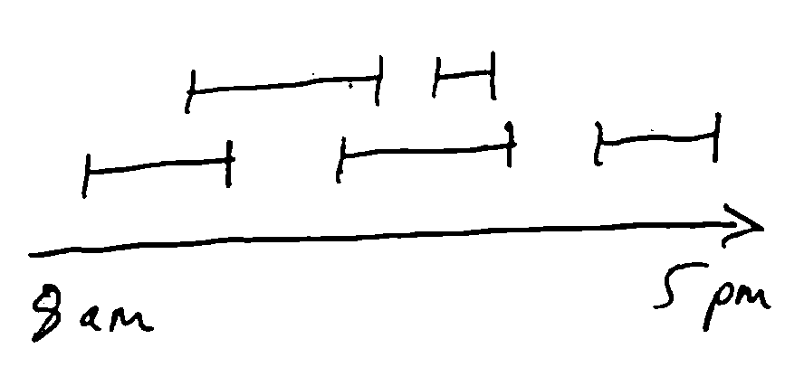
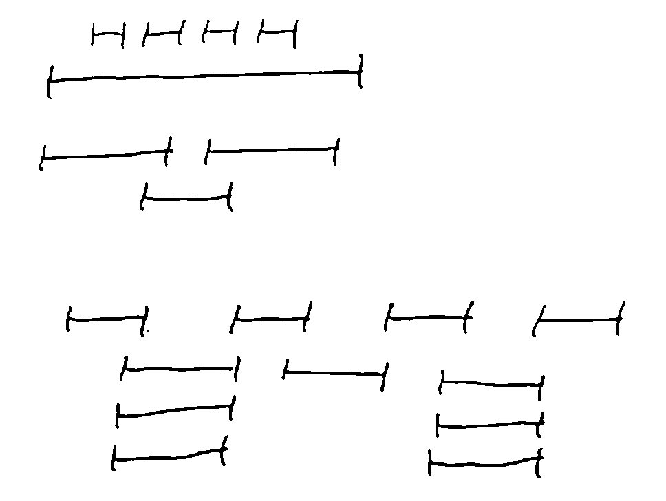
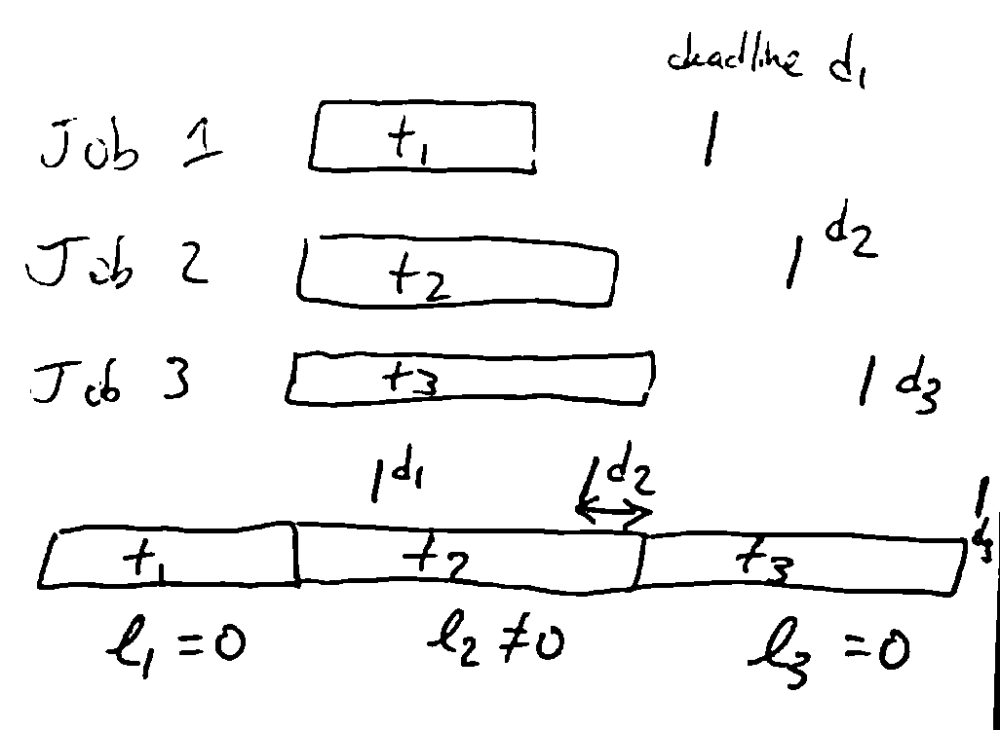
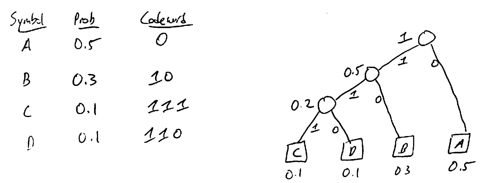

Greedy Algorithms
=================

Idea: build up a solution incrementally, taking the best available option at each step (e.g. Kruskal/Prim)

This kind of "local" reasoning doesn't necessarily yield a globally optimal solution. The trick in designing a
greedy algorithm is to find a greedy strategy that you can prove gives a global optimum.

Interval Scheduling Problem
---------------------------
Have a resource which can only be used by one person at a time, and people want to use it at different time periods.

We have *n* **requests** of the form :math:`(s(i), f(i))` giving the starting and finishing times. Want to find the
largest possible subset (by cardinality) of non-overlapping (compatible) requests.

Natural greedy approach:

1. Use some heuristic to select a request *i* and add it to our set
2. Delete all requests incompatible with *i*
3. Repeat until there are no requests left

Possible heuristics:

- Earliest request (does not work)
- Shortest request (does not work)
- Fewest conflicts (does not work)
- Request finishing first (works!)
    - Intuition: maximize the time remaining in which to service other requests

Optimality
----------
How do you prove optimality of a greedy strategy?

Exchange Argument
^^^^^^^^^^^^^^^^^
Take an optimal solution and transform it into the solution that the algorithm outputs without increasing its cost.

e.g. proof of cut property: we took an MST and showed that using the edge chosen by Kruskal/Prim would decrease its cost

Inductive Argument
^^^^^^^^^^^^^^^^^^
Break up an optimal solution into stages, and show inductively that the greedy algorithm does at least as well as the
optimal solution in each successive stage

ISP
^^^
We use the inductive argument to prove the optimality of the "smallest finishing time" heuristic for the interval
scheduling problem:

Call the set of intervals chosen by the algorithm *A*.

First, *A* is compatible, since we throw out incompatible requests each time we add a new request to *A*.

Take an optimal set of requests *O*. Need to show that :math:`|A| = |O|`.

Let :math:`i_1, i_2, ..., i_k` be the intervals of *A* in the order they were added.

Let :math:`j_1, j_2, ..., j_m` be the intervals of *O* in left-to-right order.

Then need to show that :math:`k=m`. Intuition for our heuristic was to make the resource available as soon as possible,
so let's prove that (i.e., for all :math:`r \leq k, f(i_r) \leq f(j_r)`). Prove by induction on *r*.

**Base Case**: :math:`r=1` - Algorithm picks :math:`i_1` to be the request with smallest finishing time, so
:math:`f(i_1)\leq f(j_1)`.

**Inductive Case**: :math:`r > 1` - Assume that :math:`f(i_{r-1}) \leq f(j_{r-1})`. Since :math:`j_{r-1}` is 
compatible with :math:`j_r`, :math:`f(j_{r-1}) \leq s(j_r)`.

So by the hypothesis, :math:`f(i_{r-1}) \leq f(j_{r-1}) \leq s(j_r)`, so :math:`i_{r-1}` is compatible with :math:`j_r`,
and therefore :math:`j_r` is one of the options considered when picking :math:`i_r`.

Since the algorithm picks the request with least finishing time amongst those consistent with the previously-chosen
requests, :math:`f(i_r) \leq f(j_r)`.

So by induction, :math:`f(i_r) \leq f(j_r) \forall r \leq k`.

Now suppose that *A* was not optimal, i.e. :math:`k < m`. By above, :math:`f(i_k) \leq f(j_k)`. Since *O* is compatible,
:math:`f(j_k) \leq s(j_{k+1})`, so :math:`j_{k+1}` is compatible with :math:`i_k`, and the algorithm should not have
terminated after :math:`i_k` - contradiction.

Scheduling to Minimize Lateness
^^^^^^^^^^^^^^^^^^^^^^^^^^^^^^^
Have *n* jobs which have durations :math:`t_i` and deadlines :math:`d_i`. If we start job *i* at time :math:`s(i)` and
finish it at :math:`f(i) = s(i) + t_i`, the *lateness* :math:`l_i = \max(0, f(i)-d_i)`.

We want a schedule minimizing the maximum lateness :math:`\max_i l_i`.

A greedy strategy which is optimal: "earliest deadline first": sort jobs in order of increasing :math:`d_i` and
execute them in that order.

We use the exchange argument to prove optimality: convert an optimal schedule into the EDF schedule without increasing
the maximum lateness.

.. note::
    The EDF schedule has no gaps (idle time) between jobs.

    **Lemma**: There is an optimal schedule with no idle time.

.. note::
    Our EDF schedule also has no *inversions*: executing job *i* before *j* when :math:`d_i>d_j`.

    **Lemma**: The EDF schedule is the unique idle-free schedule with no inversions, up to rearranging jobs with the
    same deadline (and note that such rearranging does not change the maximum lateness).

Now the idea is to take an idle-free optimal schedule, and eliminate inversions without increasing max lateness -
this will then show EDF is just as good, by above lemma.

.. note::
    **Lemma**: If an idle-free schedule has an inversion, it has an inversion of adjacent jobs.

    **Proof**: Assume not. Let :math:`(i, j)` be a closest inversion, and let *k* be the job after *i*.

    .. image:: _static/greedy4.png
        :width: 400

    If :math:`d_i > d_k`, then :math:`(i, k)` is an adjacent inversion. (done)

    Otherwise, :math:`d_i \leq d_k`, so :math:`d_k > d_j`, so :math:`(k, j)` is an inversion. This contradicts
    :math:`(i, j)` being a closest inversion.

.. note::
    **Lemma**: Swapping the jobs of an adjacent inversion reduces the number of inversions by 1, and does not increase
    the maximum lateness.

    .. image:: _static/greedy5.png
        :width: 400

    **Proof**: Swapping *i* and *j* doesn't change the lateness of any jobs other than *i* and *j*. Job *j* can only
    get a reduced lateness since it now ends earlier. If job *i* is late,

    .. math::
        l_i & = f(i) - d_i \\
            & = f(j)_{old}-d_i \\
            & \leq f(j)_{old} - d_j \\
            & \leq l_{j, old}

    So the old maximum lateness ≥ the new maximum lateness.

**Thm**: The EDF schedule is optimal.

**Proof**: Let :math:`S` be an optimal idle-free schedule with fewest inversions.

If it has no inversions, its maximum lateness = that of the EDF schedule.

Otherwise, we can exchange the jobs in an adjacent inversion to get a schedule with fewer inversions, but as good
maximum lateness. This contradicts the idea that *S* has fewest inversions.

Huffman Coding
^^^^^^^^^^^^^^
If you want to compress data, you take advantage of the data not being completely random.

.. note::
    **Ex**: Suppose you want to send a message using only letters A, B, C, D. In general, would take 2 bits per letter
    (e.g. ``A = 00. B = 01, C = 10, D = 11``).

    If some letters are more likely than others, could give those shorter *codewords*. E.g. ``A = 0``, ``B = 10``,
    ``C = 111``, ``D = 100``. E.g. ``CAAB = 1110010`` = 7 bits

To be able to uniquely decode, need a *prefix-free code*: no codeword is a prefix of another.

Huffman coding gives an *optimal* prefix-free code (i.e. minimizes the expected length of the message).

Greedy algorithm to build encoding/decoding tree: repeatedly merge the nodes with least probability

