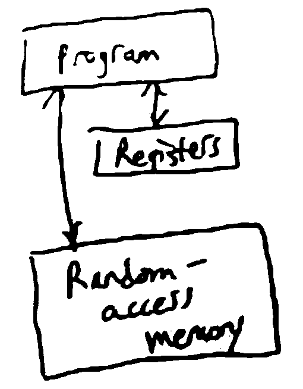

Introduction
============

**What is an Algorithm?**

- Computational processes for solving problems (i.e. a formal procedure followable by a computer)
- Foundational subject in CS
    - Even most simple operations, like addition: how do you compute the binary representation of X + Y?

**What does Analysis mean?**

- Proving algorithms correct (every input has the correct output)
- Working out time/memory requirements to solve problems of a given size
- Designing algorithms for new problems
    - Toolkit of general techniques for designing algorithms (e.g. divide-and-conquer, dynamic programming)

Example
-------
**The Convex Hull Problem**

Input: a set of points in the 2D plane (as a set of (x, y) coords)

Output: the convex hull (the smallest convex polygon containing all the points)

.. image:: _static/intro1.png
    :width: 500

One algorithm used to solve this problem is "gift wrapping":

.. code-block:: py

    find the lowest point (min y-coord)  # top, leftmost, etc also work
    rotate a ray going directly east of the point CCW until it hits a point
    repeat until the ray returns to the start

.. image:: _static/intro2.png
    :width: 350

You can find the "first point CCW" by calculating the angle from a given point to all other points, and taking the
lowest:

.. image:: _static/intro3.png
    :width: 350

How long does this take?

For a worst case, :math:`O(n^2)` - you calculate N angles to each other point from each of the N points.

However, there is a faster divide-and-conquer algorithm:

.. code-block:: py

    find convex hull for the left/right halves of the set
    combine them by the tangents of each polygon

.. image:: _static/intro4.png
    :width: 500

Algorithms
----------
*a computational procedure to solve a problem*

Problem
^^^^^^^
*a mapping or relation from inputs to outputs*

- **Input**: an instance of the problem
    - e.g. an input might be a list of points in the convex hull problem
    - the encoding of the instance into a binary sequence is important - solving for lists of pairs of numbers is different than solving for strings
- **Output**: solution to the problem instance
    - e.g. a list of points making up the convex hull, in order
    - there can be multiple valid solutions for some problem instances, e.g. sorting

Key property of an algorithm for problem P: for any instance of P, running the algorithm on the instance
will cause it to eventually terminate and return a corresponding solution

If an algorithm does so, it is called *correct*.

To measure the time for an algorithm to execute, we need to define "computational procedure":

Computational Procedure
^^^^^^^^^^^^^^^^^^^^^^^
*the RAM model*

Idea: algorithm = program running on an abstract computer, e.g. Turing Machine (CSE 103)

The RAM model is an abstract computer that is more complex than TMs but closer to a real computer.

**Elements of the RAM model**

- registers
    - store some finite amount of finite-precision data (e.g. ints or floats)
- random access memory (RAM)
    - stores data like registers, but with infinitely many addresses
    - can look up the value at any address in constant time
- program
    - a sequence of instructions that dictate how to access RAM, put them into registers, operate on them, then write back to RAM
    - e.g. load value from RAM/store into RAM
    - arithmetic, e.g. ``add r3 r1 r2``
    - conditional branching, e.g. "if r1 has a positive value goto instruction 7"

So, an algorithm is a program running on a RAM machine - in practice, we define algoritms using pseudocode, and
each line of pseudocode might correspond to multiple RAM machine instructions.

Runtime
^^^^^^^
The *runtime* of an algorithm (on a particular input) is then the number of executed instructions in the RAM machine.

To measure how efficient an algorithm is on all inputs, we use the *worst case* runtime for all inputs of a given size.

For a given problem, define some measure ``n`` of the size of an instance (e.g. how many points in the convex hull
input set, number of elements in a list, number of bits to encode input). Then the worst case runtime of an algorithm is
a function ``f(n) = the maximum runtime of the algorithm on inputs of size n``.

Ex. The convex hull gift wrapping algorithm has a worst-case runtime of roughly :math:`n^2`, where n is the # of
points.

