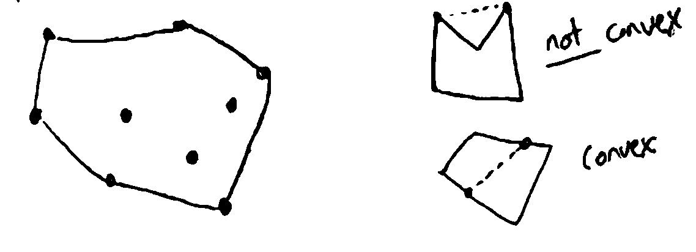
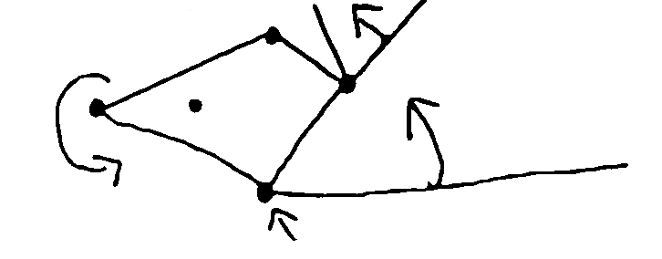
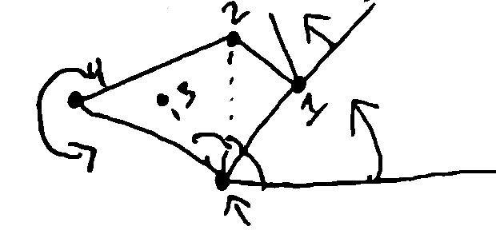
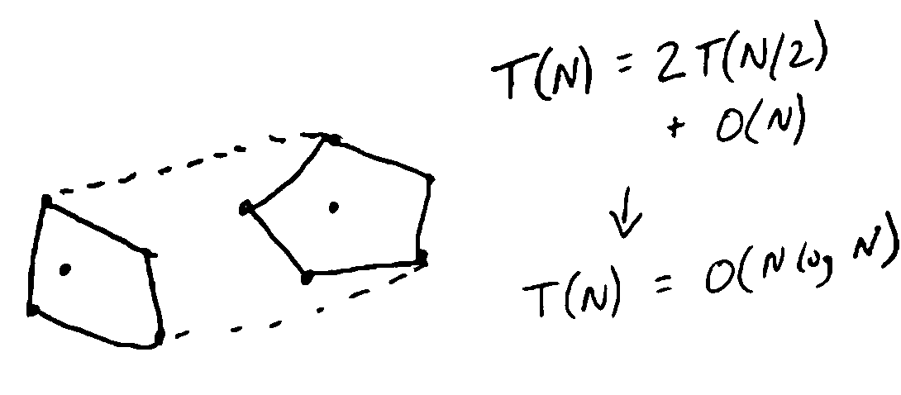

Introduction
============

**Transcript**

:download:`Available here <_static/lec1.txt>`

**What is an Algorithm?**

- Computational processes for solving problems
- Foundational subject in CS
    - Even most simple operations, like addition: how do you compute the binary representation of X + Y?

**What does Analysis mean?**

- Proving algorithms correct (every input has the correct output)
- Working out time/memory requirements to solve problems of a given size
- Designing algorithms for new problems
    - Toolkit of general techniques for designing algorithms (e.g. divide-and-conquer, dynamic programming)

Example
-------
**The Convex Hull Problem**

Input: a set of points in the 2D plane (as a set of (x, y) coords)

Output: the convex hull (the smallest convex polygon containing all the points)

One algorithm used to solve this problem is "gift wrapping":

.. code-block:: py

    find the lowest point (min y-coord)  # top, leftmost, etc also work
    rotate a ray going directly east of the point CCW until it hits a point
    repeat until the ray returns to the start

You can find the "first point CCW" by calculating the angle from a given point to all other points, and taking the
lowest:

How long does this take?

For a worst case, :math:`O(n^2)` - you calculate N angles to each other point from each of the N points.

However, there is a faster divide-and-conquer algorithm:

.. code-block:: py

    find convex hull for the left/right halves of the set
    combine them by the tangents of each polygon

