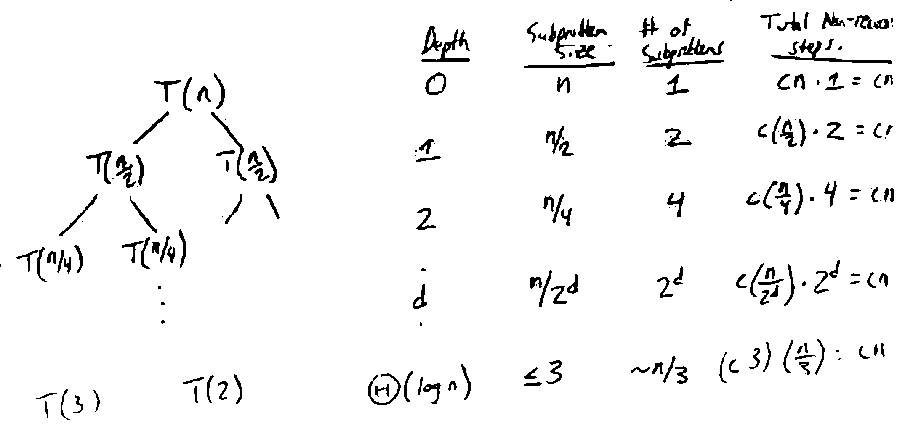

Recurrence
==========
When analyzing the runtime of a recursive algorithm, you can write the *total* runtime in terms of the runtimes
of the recursive calls, creating a *recurrence relation*.

E.g. the divide-and-conquer convex hull algorithm, with 3 main steps:

.. code-block:: text

    Split points into left and right halves                 # O(n)
    Recursively find the convex hulls of each half          # 2T(n/2)
    Merge the 2 hulls into a single one by adding tangents  # O(n)

So in total:

.. math::
    T(n) & =O(n)+2T(\frac{n}{2})+O(n) \\
         & =2T(\frac{n}{2})+O(n)

Note: A base case is required for recurrences; problem-specific (for convex-hull :math:`n \leq 3` is the base case)

Solving
-------

Recursion Tree
^^^^^^^^^^^^^^
e.g. :math:`T(n)=2T(\frac{n}{2})+O(n)`

Solving for the max depth of the base case:
:math:`\frac{n}{2^d}\leq 3 \to 2^d \geq \frac{n}{3} \to d \geq \log_2(\frac{n}{3}) = \log_2(n) - \log_2(3) = \Theta(\log n)`

In conclusion, the work at each level is :math:`\Theta(n)`, with :math:`\Theta(\log n)` levels, so the total runtime
is :math:`\Theta(n \log n)`.

The recursion tree is used informally to guess the asymptotic solution of a recurrence, but it does not prove
the solution works.

Induction/Substitution
^^^^^^^^^^^^^^^^^^^^^^
Solve for a guess using some other method (e.g. recurrence tree), then use subtitution to prove.

e.g. :math:`T(n)=2T(n/2)+O(n)`

- guess that :math:`T(n)=O(n \log n)`
- need to prove :math:`\exists n_0, c > 0` s.t. :math:`\forall n \geq n_0, T(n) \leq c n \log n`.

Fix :math:`n_0` and :math:`c`, and prove :math:`T(n)\leq cn \log n` for :math:`n \geq n_0` by induction on *n*

- Base case (:math:`n = n_0`): Need :math:`T(n_0) \leq cn_0 \log n_0`
    - Take :math:`n_0 > 1`, then pick *c* large enough to satisfy the inequality
- Inductive case: Assume :math:`T(m) \leq cm \log m` for all :math:`m < n`
    - then :math:`T(n) = 2T(n/2)+O(n)`
    - since :math:`n/2 < n`, :math:`T(n/2)\leq c \frac{n}{2} \log \frac{n}{2}` (by IH)
    - :math:`T(n) \leq \frac{2cn}{2} \log \frac{n}{2} + dn` (for some constant *d*)
    - :math:`T(n) \leq cn (\log \frac{n}{2}) + dn`
    - :math:`= cn (\log n - \log 2) + dn`
    - :math:`= cn \log n + n (d -c \log 2)`
    - :math:`\leq cn \log n` if :math:`c \geq \frac{d}{\log 2}`
    - This establishes the inductive hypothesis at *n*.
- By induction, :math:`T(n) \leq cn \log n` for all :math:`n \geq n_0`.

If you wanted to prove :math:`\Theta(n)`, the proof would look similar to the proof above, but with the :math:`\leq` and
:math:`\geq` reversed to prove :math:`\Omega(n)`.

Master Theorem
^^^^^^^^^^^^^^
For recurrences of the form :math:`T(n) = aT(n/b) + f(n)`, we can use the master theorem for divide-and-conquer
recurrences. (not proved in class - proof by recursion trees in CLRS)

**Thm**: If :math:`T(n)` satisfies a recurrence :math:`T(n) = aT(n/b) + f(n)` where :math:`a \geq 1, b > 1`, or
the same recurrence with either :math:`T(\lfloor n/b \rfloor)` or :math:`T(\lceil n/b \rceil)`, then defining
:math:`c = \log_b a`, we have:

1. If :math:`f(n) = O(n^{c-\epsilon})` for some :math:`\epsilon > 0`, :math:`T(n) = \Theta(n^c)`
2. If :math:`f(n) = \Theta(n^c)`, :math:`T(n) = \Theta(n^c \log n)`
3. If :math:`f(n) = \Omega(n^{c+\epsilon})` for some :math:`\epsilon > 0` and :math:`af(n/b) \leq df(n)` for some :math:`d < 1` and sufficiently large *n*, :math:`T(n) = \Theta(f(n))`

**Examples**

- :math:`T(n) = 9T(n/3)+n`
    - :math:`c = \log_3 9 = 2`
    - Case 1: :math:`n = O(n^{2-\epsilon})`
    - so :math:`T(n) = \Theta(n^2)`
- :math:`T(n) = T(2n/3)+1`
    - :math:`c = \log_{3/2} 1 = 0`
    - Case 2: :math:`1 = \Theta(n^0) = \Theta(1)`
    - so :math:`T(n) = \Theta(\log n)`
- :math:`T(n) = 3T(n/4)+n^2`
    - :math:`c = \log_4 3 < 1`
    - Case 3: :math:`n^2 = \Omega(n^{c+1})` (:math:`\epsilon = 1, c + 1 < 2`)
    - check: is :math:`3(n/4)^2 \leq dn^2` for some *d*?
        - :math:`\frac{3}{16}n^2 \leq dn^2` for :math:`d=\frac{3}{16}<1`
    - so :math:`T(n)=\Theta(n^2)`
- :math:`T(n)=4T(n/2)+3n^2`
    - :math:`c=\log_2 4 = 2`
    - Case 2: :math:`3n^2=\Theta(n^2)`
    - so :math:`T(n)=\Theta(n^2 \log n)`

There is a generalization of the master theorem for differently-sized methods: the Akra-Bazzi method (not in this class)
