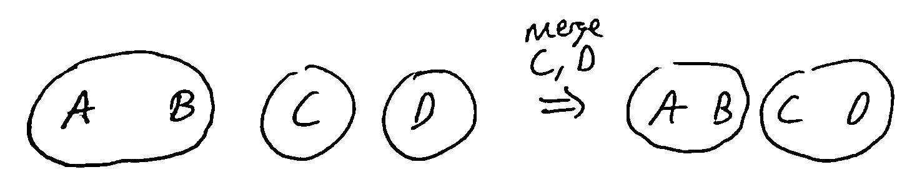
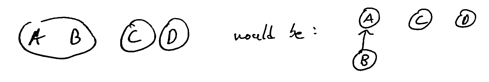
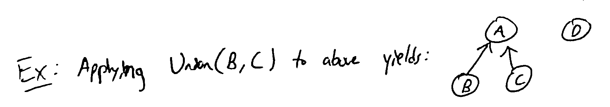
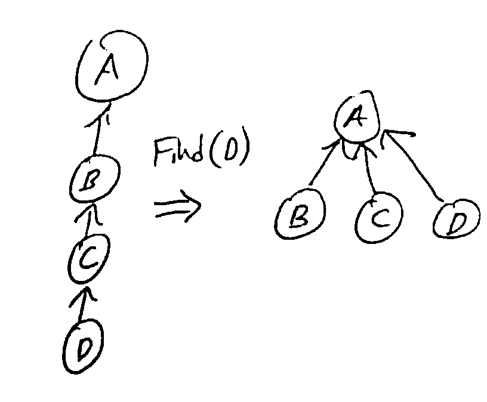

Data Structures
===============

Priority Queues
---------------
A set of items with a numerical "key" giving its priority in the queue (smaller key = higher priority).

Useful when we want to track several items to process, like FIFO queue, but we want to be able to insert high-priority
items that get handled before elements already in the queue.

Operations
^^^^^^^^^^

- Insert: add a new item *x* with a key *k*
- Find-Min: find the item with the least key value
- Delete-Min: remove the item with the least key value
- Delete: remove a particular item *x* from the queue given a pointer to it
- Decrease-Key: change the key of item *x* to a smaller *k*
- Merge/Meld/Join (rarely): combine 2 disjoint priority queues

.. note::
    Certain textbooks will use higher key as higher priority, rather than lower. Formally, this is "max-priority" vs
    "min-priority" queues.

Implementations
^^^^^^^^^^^^^^^

.. note::
    In the table below, :math:`O(n)` is assumed as a tight upper bound, i.e. :math:`\Theta(n)` so I don't have to type
    ``\Theta`` each time.

+----------------------+----------+----------+----------+------------+--------------+
| Implementation       | Insert   | Delete   | Find-Min | Delete-Min | Decrease-Key |
+======================+==========+==========+==========+============+==============+
| Unsorted Linked List | O(1)     | O(1)     | O(n)     | O(n)       | O(1)         |
+----------------------+----------+----------+----------+------------+--------------+
| Sorted Linked List   | O(n)     | O(1)     | O(1)     | O(1)       | O(n)         |
+----------------------+----------+----------+----------+------------+--------------+
| Heap (min-heap*)     | O(log n) | O(log n) | O(1)     | O(log n)   | O(log n)     |
+----------------------+----------+----------+----------+------------+--------------+
| Fibonacci Heap       | O(1)     | O(log n) | O(1)     | O(log n)** | O(1)**       |
+----------------------+----------+----------+----------+------------+--------------+

\*: A tree where each node's parent has a smaller value than it.

\**: Time averaged over a larger sequence of operations (amortized).

The best implementation to use depends on how the priority queue is being used in your algorithm. We only discuss
the top 3 implementations in this class.

Amortized Runtimes
------------------
Instead of finding worst-case bounds for individual operations, find the worst case over *any sequence* of *m*
operations and average over them. This can yield better bounds if the worst case for an individual operation can't
happen every time.

Automatically-expanding Arrays
^^^^^^^^^^^^^^^^^^^^^^^^^^^^^^
e.g. C++ vector, Python list

Allocate a fixed-size array to store a list; when it fills up, allocate an array of twice the size and copy
the old array into it. Notice that since you sometimes have to copy on an append, the worst case append
operation could take linear time. Naively, we might think then that doing *n* appends would take
:math:`1+2+3+...+n = \Theta(n^2)` time.

But we don't run the copy operation for every append, so our time for a single append onto a list of *n* elements:

.. math::
    T(n) & = \Theta(n) \text{ if n is a power of 2} \\
         & = \Theta(1) \text{ otherwise}

Then, doing *n* appends onto an empty list will take time:

.. math::
    \sum_{i=0}^{n-1} T(i) & = \Theta(n) \cdot \Theta(1) + 1 + 2 + 4 + 8 + ... + 2^{\lfloor \log_2 n \rfloor} \\
                          & = \Theta(n) \cdot \Theta(1) + \Theta(n) \\
                          & = \Theta(n).

Therefore, the *amortized* worst-case runtime of an append operation is :math:`\Theta(n)/n = \Theta(1)`.

.. note::
    :math:`1+2+4+...+2^{\lfloor \log_2 n \rfloor} \leq 2n = \Theta(n)`.

    Note that it's *not* :math:`\Theta(\log n)\cdot \Theta(n)` because that would assume you copy the full *n*-length
    list each time.

Incrementing Binary Counter
^^^^^^^^^^^^^^^^^^^^^^^^^^^
Suppose we have a binary counter as an array of *k* bits. Incrementing can cause a chain of carries forcing us to
update all bits: so increment is :math:`\Theta(k)` time in worst case.

But does this mean incrementing *n* times takes :math:`\Theta(nk)` time? No! It's :math:`O(nk)` but not
:math:`\Omega(nk)`.

The LSB flips every increment, the next bit every other increment, the next half as much, etc. So an increment on
average only needs :math:`1 + 1/2 + 1/4 +... \leq 2` flips.

So the amortized runtime of increment is :math:`\Theta(1)`.

Disjoint-Set Data Structures
----------------------------
aka "union-find"

Want to keep track of items which are partitioned into sets, where we can look up the set an item is in and merge
2 sets.

Operations:

- Find: Given a pointer to an item, find which set it's in (returning a representative element or ID #)
- Union: Given 2 items, merge the sets the items are in into a single set

The most commonly used data structure for this is the *disjoint-set forest*.

**Idea**: Represent each item as a node in a forest, with a parent pointer indicating their parent node, if any.
Each root node represents a set, and all its descendants are members of the same set.

We can then implement the operations as follows:

- Find: follow parent pointers until you reach a root, which is the representative element of the set containing the item
- Union: use Find to find the roots of each item, then make one root the parent of the other

The runtime of Find(x) is linear in the depth of x in its tree, since we follow pointers all the way to the root. So
we want to keep the trees shallow - we use 2 heuristics:

- Path compression: when we do a find, change all nodes visited to point directly to the root

- Union by rank: when we do a union, make the shallower tree a child of the deeper one

With both heuristics, the amortized runtime of Find and Union is :math:`O(\alpha(n))` where :math:`\alpha(n) \leq 4`
for all *n* less than the number of atoms in the universe (the inverse Ackermann function)
